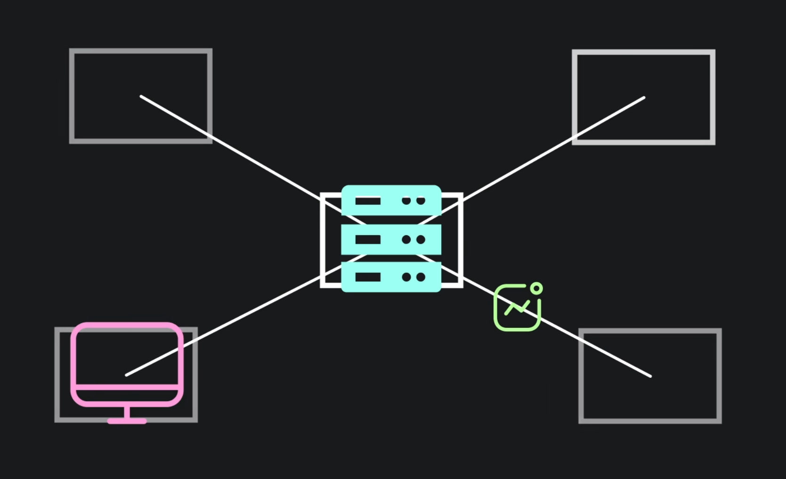

## 项目先导

哈基米大冒险是一款联机打字游戏，教程来自B站Up主Voidmatrix。

链接：【从零开始的C++游戏开发】联机初体验！从零开始速成C++联机游戏开发！| EasyX制作哈基米大冒险】 https://www.bilibili.com/video/BV1yjsoeREdZ/

玩法上：两位玩家将分别扮演诗歌剧和东海帝王。在曲折的道路上比拼打字手速，先跑完的胜利。

在技术上： 

1. 会讲解如何搭建HTTP服务器，并实现不同客户端之间的数据同步。
2. 同时还会讲解如何使用多线程来优化程序性能以及涉及到的原子操作、互斥锁等线程同步技术。

教程旨在开发联机游戏的原型。

需要注意的是——联机游戏 ≠ 单机游戏 + 网络通信

想要保障高性能的数据传输，低延迟的游戏世界同步，又或者是应对弱网重连或防作弊等更进一步的功能，一个完善的联机游戏框架需要在游戏开发伊始阶段就要精心设计。

 

## 速通联机游戏开发基础与HTTP服务器搭建

理论支持 & 代码

### 理论基础

如果我们希望在不同玩家的电脑上实时地呈现出同一个游戏世界——那么我们需要”同步“——我们就必须做到让这些设备之间的数据进行”同步“——我们可以简单地理解成为是“世界状态”的拷贝。

如何理解世界状态？可以理解为游戏需要的敌人坐标，玩家坐标等必要的游戏参数。**如果可以同过某种手段确保这些数据能在不同玩家的电脑上保持一致便可实现联机游戏的功能。**

游戏联机中最常见的，是星型拓扑网络结构：

服务器作为世界的权威，众多客户端程序都与这个中心服务器进行连接，从中获取最新的游戏状态数据，然后在本地根据客户端预先设计好的逻辑，将这些内容渲染倒窗口上。

——在这种采用这种网络拓扑结构的联机模式下，**客户端仅处理玩家输入和画面渲染，相当于是介入了网络的显示器和手柄**。**而整个世界的运转逻辑，被拆分到了服务端程序上。**

### 代码实践

本项目中，将使用**cpp-http**这个C++第三方库来帮助我们处理HTTP相关的内容。

这时一个.h文件，我们只需要下载即可。

Github仓库地址：https://github.com/yhirose/cpp-httplib
